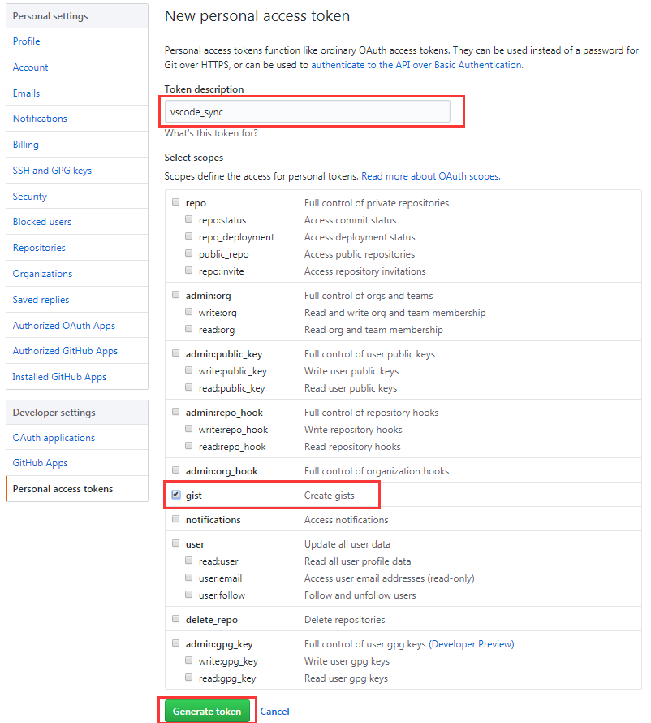

实现设备上编辑器（VSCode）的统一配置

<!-- more -->

电脑上需安装VSCode，拥有一个github账户。实现同步的功能主要依赖于VSCode插件 "Settings Sync"

**Setting Sync 可同步包含的所有扩展和完整的用户文件夹**

1) 设置文件

2) 快捷键设置文件

3) Launch File

4) Snippets Folder

5) VSCode 扩展设置

6) 工作空间

**Setting Sync 快捷键：**

1) 上传： Shift + Alt + U (Sync: Update / Upload Settings)

2) 下载： Shift + Alt + D (Sync: Download  Settings)

**Step1 安装同步插件"Settings Sync"**

**Step2. 进入github -> Settings 在左侧 Developer settings -> Personal access tokens**
1) 点击按钮 Generate new token 新增一个token

2) 回到VSCode配置将token配置到本地
Shift + Alt + U 在弹窗里输入你的token，回车后会存储VSCode的设置及所安装的插件列表
(在文件地址C:\Users\Administrator\AppData\Roaming\Code\User有一个配置文件可以找到这个gist值)

**Step3. 在别的电脑设置上同步下载设置**
(Sync: Download  Settings) Shift + Alt + D 在弹窗里输入你的github生成的token值，稍后片刻便可同步成功