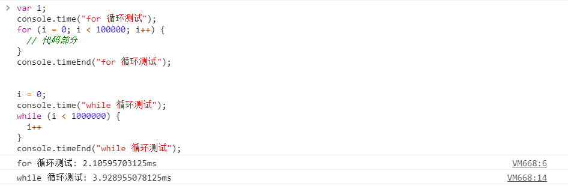

console命令， 让js调试更简单
<!-- more -->
console.time() 方法是作为计算器的起始方法。

该方法一般用于测试程序执行的时长。

console.timeEnd() 方法为计算器的结束方法，并将执行时长显示在控制台。

如果一个页面有多个地方需要使用到计算器，可以添加标签参数来设置。
```
// 测试哪个代码执行的更快
var i;
console.time("for 循环测试");
for (i = 0; i < 100000; i++) {
  // 代码部分
}
console.timeEnd("for 循环测试");


i = 0;
console.time("while 循环测试");
while (i < 1000000) {
  i++
}
console.timeEnd("while 循环测试");
```
控制台输出结果如下图:
