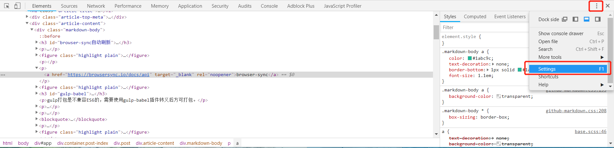
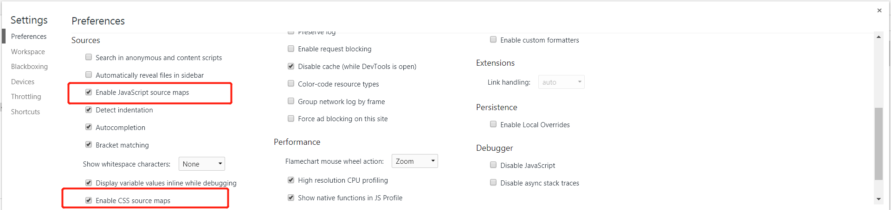

使用gulp插件可以实现一些文件资源的压缩合并以及编译低版本浏览器能识别的格式，还可以实现自动刷新
<!-- more -->

### browser-sync自动刷新
Browsersync能让浏览器实时、快速响应您的文件更改（html、js、css、sass、less等）并自动刷新页面。更重要的是 **Browsersync可以同时在PC、平板、手机等设备下进项调试**

```
var browserSync = require('browser-sync');
```
[browser-sync](https://browsersync.io/docs/api)
```
var browserSync = require('browser-sync').create();
gulp.task('browser-sync', function () {
    browserSync.init({
        server:{
            baseDir:'./',  // 设置服务器的根目录
        }
    })
})

gulp.task('watch', function(){
    gulp.watch('src/assets/less/*.less', gulp.series('concat-css', 'browser-sync', browserSync.reload));
    gulp.watch('src/common/*.js', gulp.series('concat-js', browserSync.reload));
})
```
### gulp-babel
gulp打包是不兼容ES6的，需要使用gulp-babel插件转义后方可打包。

`npm install --save-dev gulp-babel babel-preset-es2015 babel-preset-stage-2`

其中babel -preset-es2015 是ES2015转码规则，babel-preset-stage-0/1/2/3 是ES7不同阶段语法提案的转码规则】（共有4个阶段）

> Babel是一个广泛使用的ES6转码器，可以将ES6代码转为ES5代码，从而在现有环境执行。

### 安装
```
# Babel 7
$ npm install --save-dev gulp-babel @babel/core @babel/preset-env

# Babel 6
$ npm install --save-dev gulp-babel@7 babel-core babel-preset-env
```
安装babel系列包，确保只有一个babel的版本，不能同时有6.X 和 7.X 否则会报错

以及需要新建.babelrc(注意开头有个.)文件
.babelrc的内容如下：

```
{
    "presets": ["env"]
}
```
gulp-babel插件的用法

```
const gulp = require('gulp');
const babel = require('gulp-babel');
 
gulp.task('default', () =>
    gulp.src('src/app.js')
        .pipe(babel())
        .pipe(gulp.dest('dist'))
);
```
### gulp-less
将less预处理为css
```
var less = require('gulp-less');
var path = require('path');
 
gulp.task('less', function () {
  return gulp.src('./less/**/*.less')
    .pipe(less())
    .pipe(gulp.dest('./public/css'));
});
```
### gulp-clean-css
css文件的压缩
```
let gulp = require('gulp');
let cleanCSS = require('gulp-clean-css');

gulp.task('minify-css', () => {
  return gulp.src('styles/*.css')
    .pipe(cleanCSS())
    .pipe(gulp.dest('dist'));
});
```
### gulp-uglify
压缩JS文件
```
gulp.task('concat-js', function () {
    return gulp.src('./src/common/*.js')
    .pipe(uglify({
        mangle: true,               // 是否修改变量名，默认为 true
        compress: true,             // 是否完全压缩，默认为 true
        preserveComments: 'all'     // 保留所有注释
    }))
    .pipe(gulp.dest('./build/js'))
})
```
gulp-concat
合并文件
```
var concat = require('gulp-concat');
 
gulp.task('scripts', function() {
  return gulp.src('./lib/*.js')
    .pipe(concat('all.js'))
    .pipe(gulp.dest('./dist/'));
});

gulp.task('concat-css', function () {
    return gulp.src('./src/assets/less/*.less')
    .pipe(less())
    .pipe(cleanCSS())
    .pipe(concat('app.css'))
    .pipe(gulp.dest('./build/css/'))
})
```
### gulp-sourcemaps
处理JS时，生成SourceMap,解决文件压缩后不利于查看与调试,有了sourcemap，出错的时候，除错工具将直接显示原始代码，而不是转换后的代码）
```
var gulp = require('gulp');
var uglify = require('gulp-uglify');
var concat = require('gulp-concat');
var minifyCss   = require('gulp-clean-css'),
var sourcemaps = require('gulp-sourcemaps');
 
gulp.task('jsmin', function() {
  gulp.src('src/**/*.js')
    .pipe(sourcemaps.init())
      .pipe(uglify())
      .pipe(concat('app.js'))
    .pipe(sourcemaps.write())
    .pipe(gulp.dest('dist/js'));
});

gulp.task('cssmin', function() {
    gulp.src('src/css/*.css')
    .pipe(sourcemaps.init())
    .pipe(concat('demo.css'))
    .pipe(minifyCss())
    .pipe(sourcemaps.write())
    .pipe(gulp.dest('dist/css'));
});
```
sourceMap.init( ) 启用sourcemaps功能
sourceMap.write( ) 生成记录位置信息的sourcemaps文件

例如上面jsmin例子
经过 concat 和 uglify ，将生成的app.js 与 源文件( src 下的所有js文件 )之间的位置映射信息，生成sourcemaps文件。

sourceMap.write( path )，将会在指定的 path，生成独立的sourcemaps信息文件。如果指定的是相对路径，是相对于 app.js 的路径。

无法指定路径为 src 目录，否则，sourcemaps文件会生成在 dist 目录下。

sourceMap.write( )，不传参，将会直接在 app.js 尾部，生成sourcemaps信息。

**注意**：sourceMap.init() 和 sourceMap.write() 之间使用的插件，必须支持 gulp-sourcemaps 插件

**如何在浏览器中，发挥 sourcemaps 的作用？**

谷歌浏览器中，打开开发者面板，点击右上角的设置。


下面这两个红框的选项，勾选上。


案例中，2.js中有个bug，和其它 js 文件合并压缩成 app.js 文件。在一个html页面中，只引用这个 app.js。

在浏览器中，打开这个页面，控制台就会直接显示造成bug的源文件，点击即可看到报错位置。

如果没有显示源文件，就刷新下页面，或者，去浏览器的设置中，将那两个选项勾掉，再勾上。

### gulp-if
条件判断，方便对不同的环境（开发环境、生产环境）对文件进行不同的处理

gulpif(condition, stream [, elseStream])
condition {Boolen} 判断条件或glob条件
stream condition为true时，执行的任务
elseStream condition为false时，执行的任务

可配合使用以下方式判断简单获取命令行中的参数gulp taskname –参数名
`var argv = require('yargs').argv;`

```
gulp.task('task', function() {
  gulp.src('./src/*.js')
    .pipe(gulpif(!argv.development, uglify(), beautify()))
    .pipe(gulp.dest('./dist/'));
});
```
### gulp-imagemin
压缩图片
```
var gulp = require('gulp'),
    imagemin = require('gulp-imagemin');

gulp.task('testImagemin', function () {
    gulp.src('src/img/*.{png,jpg,gif,ico}')
        .pipe(imagemin({
            optimizationLevel: 5, //类型：Number  默认：3  取值范围：0-7（优化等级）
            progressive: true, //类型：Boolean 默认：false 无损压缩jpg图片
            interlaced: true, //类型：Boolean 默认：false 隔行扫描gif进行渲染
            multipass: true //类型：Boolean 默认：false 多次优化svg直到完全优化
        }))
        .pipe(gulp.dest('dist/img'));
});
```